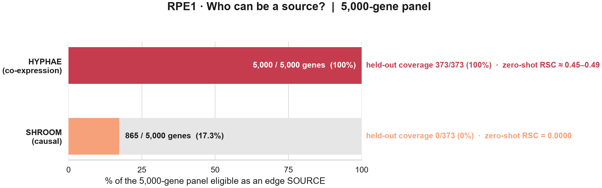
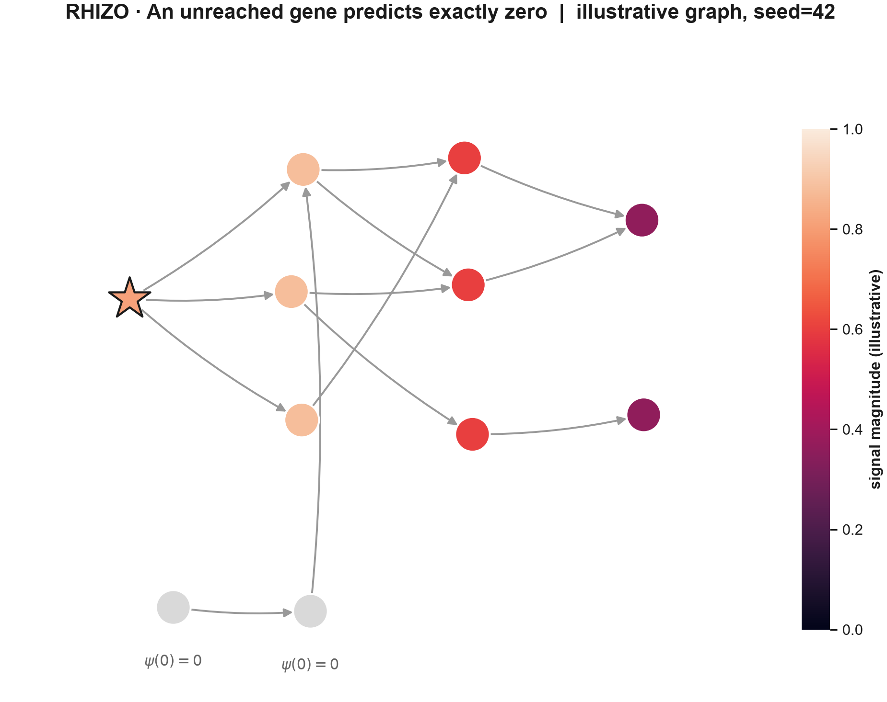
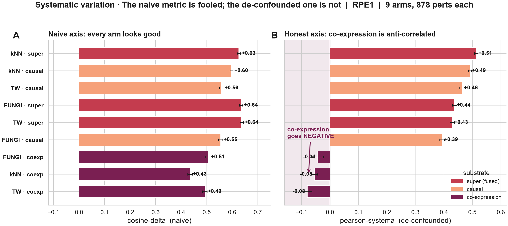
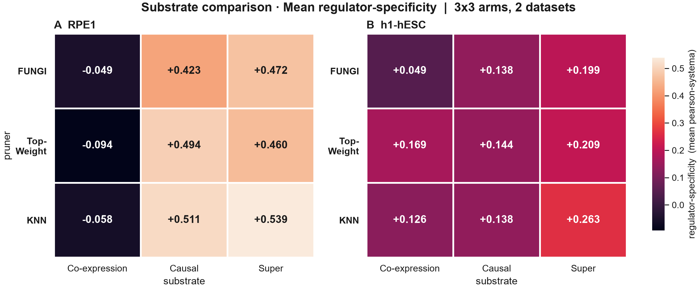
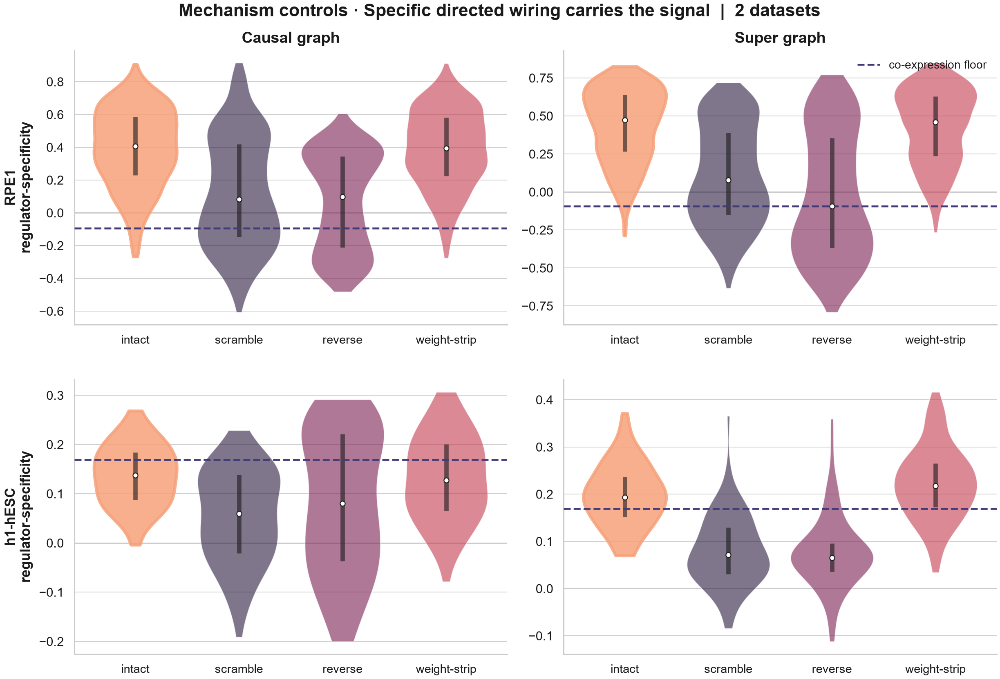
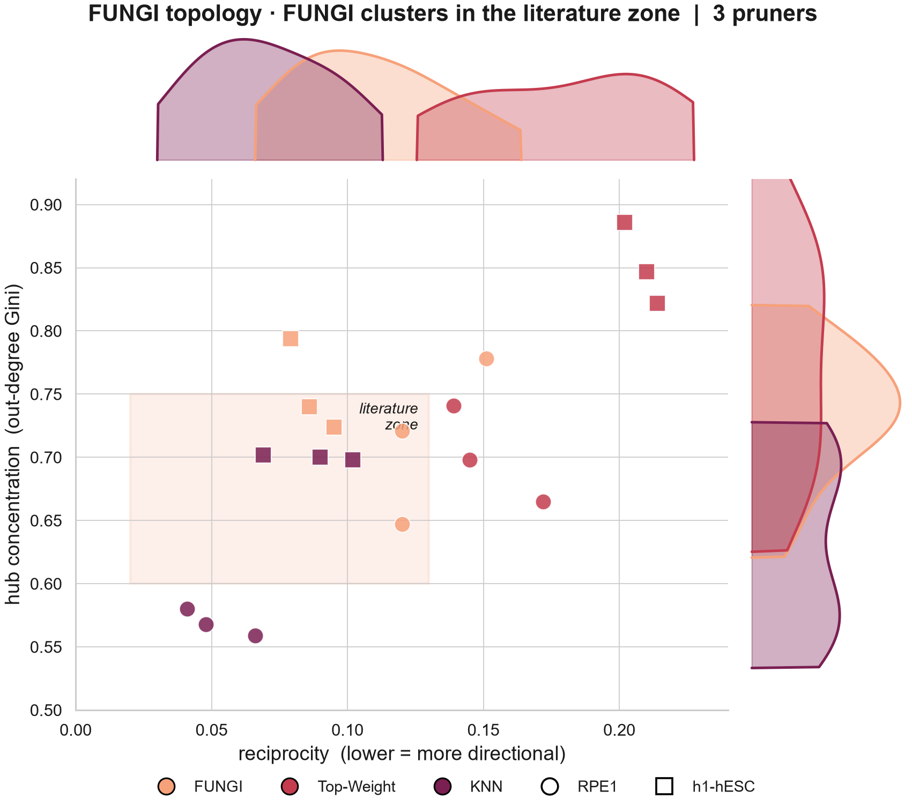
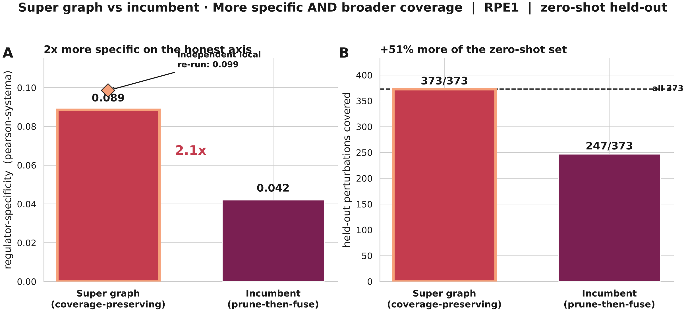
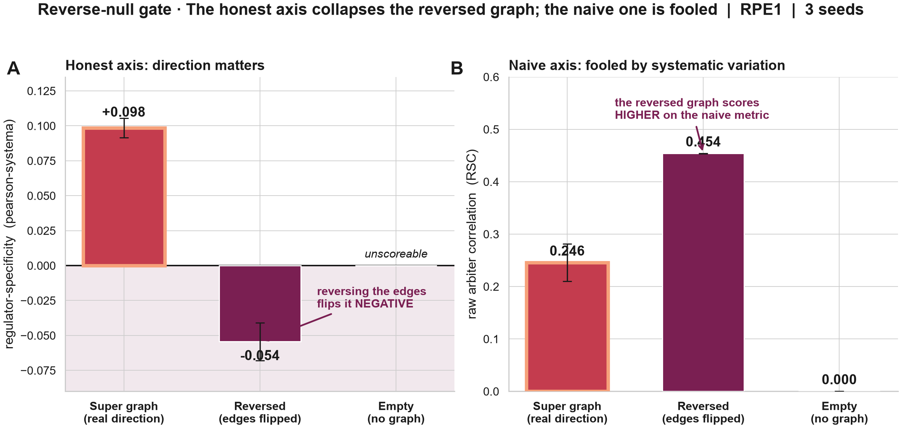

# FUNGI: Functional Unraveling of Network Geometry for Inference

FUNGI turns single-cell CRISPR perturbation data into a sparse, directed gene regulatory network (GRN) whose shape matches what the literature reports for real regulatory networks, and then tests that network by asking a graph neural network to predict perturbation responses from it. The repository contains the full route, from raw Perturb-seq counts to a curated graph and a de-confounded downstream evaluation.


*A dense inferred graph (left) carries a candidate edge between almost every gene pair. FUNGI prunes it to the sparse hub-and-spoke structure of a real GRN (right).*

This README is the short guide. It covers what each stage does, the order to run them in, the one input restriction every user needs to know, and the headline results. A full manual covering every hyperparameter and how to tune it is in preparation.

---

## Contents

* [The problem FUNGI solves](#the-problem-fungi-solves)
* [The pipeline at a glance](#the-pipeline-at-a-glance)
* [Co-expression alone works, causal alone does not](#co-expression-alone-works-causal-alone-does-not)
* [Running FUNGI, step by step](#running-fungi-step-by-step)
* [How the FUNGI pruner works](#how-the-fungi-pruner-works)
* [Results](#results)
* [Boundaries](#boundaries)
* [Repository layout](#repository-layout)
* [Status and known issues](#status-and-known-issues)
* [References](#references)

---

## The problem FUNGI solves

A gene regulatory network is the map of which genes control which others, and it is what a biologist reaches for to reason about how a cell will respond when a gene is switched off. Perturb-seq now measures the transcriptome-wide response to knocking down thousands of individual genes across hundreds of thousands of cells [5], which turns that question into a concrete prediction problem. Given a regulatory map, can a model predict the response to a perturbation it has never seen?

Three obstacles make the problem hard. No ground-truth GRN exists to train against, so every inferred network is an estimate that can only be judged indirectly. The inference methods that produce those estimates return dense graphs in which almost every gene pair carries some weight, and a downstream graph model run over that density blends every gene's signal into every other's. The perturbation data is also dominated by a large shared response that imitates regulatory biology and inflates any naive accuracy score [6].

FUNGI takes the three on together. It builds the densest, most informative candidate graph the data supports, prunes it against explicit, measurable topology targets instead of a fixed threshold, and judges the result with an evaluation that strips out the shared response before scoring.

---

## The pipeline at a glance

FUNGI runs as five stages. Each stage is also a standalone tool, so a user who only needs a clean co-expression graph, or who already has a dense graph and only wants it pruned, can run that piece alone.

| step | folder | what it does | hardware |
|---|---|---|---|
| 1 | `spore/` | Cleans the raw data, keeps every held-out perturbation target in the gene panel, builds gene-disjoint splits, and emits the control-preserving metacell substrate. | CPU, workstation |
| 2a | `coexpression_generator/` | Infers a dense co-expression graph with one gradient-boosted regression per gene. Every gene gets out-edges. | CPU cluster |
| 2b | `causality_generator/` | Infers a dense causal graph from the measured knockdown responses. Edges point from a silenced gene to the genes it moves. | single GPU |
| 3 | `supergraph/` | Fuses the causal and co-expression graphs into one directed Super graph. | CPU |
| 4 | `fungi/` | Prunes the Super graph (or a co-expression graph) to a sparse graph that sits inside literature topology bands. | single GPU |
| 5 | `rhizo/` | Predicts perturbation responses from the graph alone, holding the model fixed so any change in accuracy belongs to the graph. | single GPU |
| | `evaluation/` | Scores predictions on the de-confounded `pearson_systema` axis, plus graph-level bio and SYSTEMA evaluators. | GPU or CPU |
| | `baselines/` | Builds edge-matched Top-Weight and KNN graphs and null graphs (shuffle, reverse, empty) for comparison. | CPU |

The stage names come from the thesis this work grew out of, and the code still uses them. HYPHAE is the co-expression generator, SHROOM is the causality generator, and MYCELIUM was the name of the whole pipeline.

### SPORE: Systematic Preprocessing and Optimization for Robust Evaluation

SPORE prepares the substrate every later stage reads. It runs as a fixed sequence of numbered phases (ingestion, detection, cell triage, ambient RNA, doublets, escaper filtering, gene triage, splitting, HVG selection, normalization, confounders, cell-line separation, metacells), each reading the last phase's output, so a run is auditable and can resume mid-way. Two of its jobs matter most downstream. SPORE splits the data by perturbation, so no perturbed gene seen in training appears in evaluation, and it force-carries every held-out perturbation target into the gene panel, so the graph contains a node for every gene the evaluation will ask about. It then builds the control-preserving metacell substrate, pooling each perturbation's cells into small metacells (MiniBatchKMeans, k=2) while keeping control cells single, which denoises dropout without blurring the perturbation-versus-control contrast. SPORE refuses to report success unless coverage and the leakage firewall both pass, and it writes a `COVERAGE_REPORT.md` as proof. It also works as a general-purpose cleaner for any Perturb-seq dataset.

### The co-expression generator (HYPHAE)

The co-expression generator infers edges the way GENIE3 does [1]. For each target gene it fits a regression that predicts that gene from every other gene, and it reads each predictor's feature importance as the weight of a `Regulator → Target` edge. It uses the gradient-boosted form popularized by GRNBoost2 [2], fitting one LightGBM model per gene, bootstrapping each gene over repeated 80/20 splits with early stopping, and averaging the gain importances. Because every gene serves as a predictor for every other gene, every gene receives out-edges, including genes that were never perturbed. That full coverage is its defining strength. Its weakness follows from the same association basis. Co-expression is close to symmetric, so the direction of an edge is weakly identified, and two genes driven by a common third gene score as strongly as a true regulator and its target.

### The causality generator (SHROOM)

The causality generator is a GPU implementation of PSGRN self-training [3]. It describes every directed gene pair with four numbers. Two are control baselines for the source and the target, and two are interventional, the source and the target's expression in the cells where the source itself was knocked down. A single classifier, trained on correlation-derived pseudolabels, scores every pair from those features. The interventional features read what actually changes when the source is silenced, so the score of an edge depends on which gene was the intervention and the edge carries a direction. That makes the causal graph highly regulator-specific. It also ties its coverage to the perturbation set, which the next section explains.

### The Super graph

The two generators fail in opposite places. The co-expression graph covers every gene but cannot orient its edges, and the causal graph orients its edges but only for perturbed genes. DREAM5 showed that no single inference method wins across networks and that aggregating complementary methods is more robust than any one of them [4], and NIMEFI carried that result into rank-based aggregation of ensemble GRN methods [7]. The Super graph applies the same wisdom-of-crowds logic to one causal and one co-expression graph. Each graph's weights are first converted to normalized ranks, because gain importances and classifier probabilities live on different scales, and the ranks are then fused so the result inherits causal direction where it exists and co-expression coverage everywhere else.


*The causal core contributes a few specific hubs, the co-expression scaffold contributes coverage of every gene, and the fused Super graph carries both.*

### FUNGI: the pruner

The FUNGI pruner turns the dense Super graph into a usable one. Instead of keeping the top-weighted edges or capping every gene's degree, it treats the shape of a real GRN as an explicit objective and searches for the sparse graph that matches it. The section [How the FUNGI pruner works](#how-the-fungi-pruner-works) gives the detail.

### RHIZO: Regulatory Hop Inference, Zero Ontology

RHIZO is the downstream model. It takes a graph and the identity of a perturbed gene and predicts the genome-wide expression response, propagating the perturbation one regulatory hop at a time through a lightweight directed message-passing network. It carries zero ontology. RHIZO uses no gene-ontology graph, no pretrained gene embeddings, and no per-gene identity features, so every edge feature it reads is computed from the graph it is given. When RHIZO predicts better on one graph than on another, the graph is the only thing that changed. That property makes RHIZO the arbiter for every graph comparison in this repository.

---

## Co-expression alone works, causal alone does not

FUNGI accepts two kinds of input graph. A co-expression graph can be pruned and used on its own. A causal graph cannot serve as the only input, and this distinction matters for anyone bringing their own data.

A causal edge is scored from what happens to the target when the source is knocked down, so only a gene that was actually perturbed can carry an out-edge. Every gene that was never perturbed becomes a sink, with incoming edges and no outgoing ones. On the RPE1 panel, 866 of the 5,000 genes (17.3%) were perturbation sources. On the h1-hESC panel the figure falls to 88 of 5,000 (1.8%). A causal-only graph therefore leaves more than 80% of the panel unable to regulate anything.



*The co-expression generator can place an out-edge from every gene in the panel. The causal generator can only place one from a perturbed gene. On the held-out perturbations of the RPE1 test, the causal graph has out-edges for 0 of 373, so it has nothing to propagate.*

The consequence reaches the downstream model directly. RHIZO is built so that a gene the perturbation never reaches predicts exactly zero, which keeps it from inventing signal that the graph does not carry. A perturbed gene with no out-edges reaches nothing, so on a causal-only graph every held-out perturbation produces a flat, unscoreable prediction.



*The perturbation (star) propagates along out-edges. Genes it never reaches stay at exactly zero. A source with no out-edges reaches nothing.*

FUNGI will mechanically prune a causal-only graph, and inside the perturbed set that graph is highly regulator-specific. However, it cannot speak for any regulator that was never perturbed, so it cannot serve as a general-purpose GRN. The only setting where a causal-only graph stands alone is a dataset in which every gene in the panel was perturbed, which is the regime PSGRN was originally designed and validated in [3]. Genome-scale panels with a few hundred to a thousand perturbations are far from that regime. The supported inputs are therefore a co-expression graph on its own, or the Super graph, which keeps the causal core's specificity and borrows coverage from the co-expression scaffold. The Super graph is the recommended input.

---

## Running FUNGI, step by step

Run the stages in order. Each stage writes a file the next stage reads, and the gene panel and split produced by SPORE must stay fixed from step 1 onward. Several scripts still contain paths from the original development machine, so check `docs/KNOWN_ISSUES.md` before the first run and point every config at your own data.

### Step 1: clean and split the data with SPORE

```bash
pip install -r spore/requirements.txt
python spore/spore.py --config spore/configs/spore_config_rpe1.yaml
```

Set `paths.raw_h5ad`, `perturbation_col`, `control_label`, and the test and validation sizes in the config. SPORE checks the config against the data at startup and stops immediately if they disagree. The outputs you need are `{name}_train_hybrid.h5ad` (the graph-building substrate, training perturbations and controls only), `{name}_allsplits_metacell_ctrlpreserved.h5ad`, the split file, and `COVERAGE_REPORT.md`.

### Step 2a: build the co-expression graph

The co-expression generator is a SLURM array job. Each of 10 tasks takes a slice of the gene list and fits its genes in parallel. Copy `{name}_train_hybrid.h5ad` into `coexpression_generator/input/`, select it in the `SELECT DATASET` block of the submit script, and submit.

```bash
cd coexpression_generator
conda env create -f environment.yml
sbatch submit_coexpression.sh
# when all 10 tasks finish
python consolidate_graphs.py --chunk_dir chunks_<run_name> --output_file coexp_dense.parquet \
    --total_tasks 10 --h5ad_file input/<name>_train_hybrid.h5ad
```

Every gene is checkpointed to its own file as it finishes, so a task that dies or hits its wall time resumes where it stopped when resubmitted. This is the heaviest stage. Expect roughly 18 hours across 10 nodes of 32 cores on a 5,000-gene metacell substrate, and budget memory by measured per-worker cost rather than matrix size (see `coexpression_generator/README.md`). The output columns are `Regulator, Target, Importance`.

### Step 2b: build the causal graph

```bash
python causality_generator/causality_generator.py \
    --mc-input <name>_train_hybrid.h5ad --sc-input <name>_train_hybrid.h5ad \
    --output causal_dense.parquet --pert-col <perturbation column> \
    --control-label non-targeting --device cuda
```

Feed raw counts. The generator normalizes internally. It runs on one GPU in a fraction of the co-expression generator's cluster time.

### Step 3: fuse the two graphs into the Super graph

```bash
python supergraph/build_super_parent.py --mode fuse_then_prune --out super_dense.parquet
```

Set `DENSE_CAUSAL` and `DENSE_COEXP` at the top of the script to the two dense graphs from step 2. The default operator rank-normalizes each graph within each source gene and keeps the larger of the two ranks for every edge (rank-max union). The script restricts causal sources to training-perturbed regulators, so no held-out perturbation contributes an out-edge, and it writes a QC report next to the graph. `--causal-norm` and `--fusion-wc` switch to the alternative fusion operators. The thesis recipe, which prunes each graph first and fuses the two pruned graphs by Borda count, lives in `baselines/graph_tools.py`.

### Step 4: prune with FUNGI

```bash
python fungi/scripts/build_fungi_cache.py --graph super_dense.parquet --cache-dir cache/super --tag super
python fungi/scripts/fungi_prune.py --cache-dir cache/super --tag super \
    --lam-lo 40 --lam-hi 48 --max-edge-count 400000 --refine
```

The first command runs FUNGI's diagnostic calibration and builds the candidate pool once, and the second runs the search and writes the champion graph (`Regulator, Target, Weight`) to `fungi/outputs/fungi/champions_full/`, with the run record in `fungi/outputs/fungi/<tag>/`. `--lam-lo` and `--lam-hi` bound the density in edges per gene, so 40 to 48 on a 5,000-gene panel gives a graph of roughly 200,000 to 240,000 edges. The topology bands, hyperparameter ranges, and priors are set in `fungi/configs/`. The same two commands prune a co-expression graph on its own.

### Step 5: test the graph with RHIZO and score it

```bash
cd rhizo
python src/build_rpe1_gauntlet_data.py --root <bundle>
python src/build_caches_v3f.py --arms fungi_bio,top_weight,knn
RHIZO_ONLY_ARMS=fungi_bio,top_weight,knn \
    python src/gauntlet_v3f.py --config configs/core_anchor_b8.json --device cuda
python ../evaluation/anastomosis_scorer/score_preds.py --preds results/preds
```

The data builder reads each graph to test from `<bundle>/arms/<name>.npz` together with the held-out expression changes, and writes the training package and `data/arm_graphs/<name>.npz` that RHIZO reads. It currently targets the RPE1 layout, so a new dataset needs its own copy of this step. The gauntlet trains RHIZO on every graph under identical settings and seeds, writes one resumable result file per cell, and dumps predictions that the scorer turns into `pearson_systema`, DEG-AUPRC, and the raw correlation metrics. RHIZO fits an 8 GB laptop GPU at a small batch size. The full multi-seed comparison runs fastest on a data-centre GPU. `rhizo/docs/README_RHIZO_FINAL.md` describes the configs and the control arms.

---

## How the FUNGI pruner works

### Topology targets

A real GRN differs from a random graph in measurable ways. A small set of transcription-factor hubs regulate many targets while most genes regulate few or none, regulators cluster into feed-forward motifs, hubs tend to connect to low-degree genes, and most regulation runs in one direction. FUNGI turns each of these signatures into a target band and prunes toward all of them at once.

| target | what it measures | literature band |
|---|---|---|
| `alpha` | power-law exponent of the degree distribution (scale-free hub hierarchy) | 2.0 to 2.8 |
| `gini_in` | inequality of in-degree across genes | 0.45 to 0.60 |
| `S_max` | out-degree of the largest hub as a fraction of the panel | 0.09 to 0.18 |
| `C` | clustering, which tracks feed-forward-loop density | 0.08 to 0.20 |
| `rho` | degree assortativity (negative means hubs attach to low-degree genes) | -0.35 to -0.05 |
| `reciprocity` | fraction of edges whose reverse also exists | 0.02 to 0.12 [8] |

Out-degree inequality and modularity are also defined, and they are disabled by default because the current dense parents cannot reach them. Each band can come from one of three sources, chosen per target. By default FUNGI runs a diagnostic probe suite on the dense parent and derives the band from the data. A curated literature band can replace any probe, and the user can override any band directly in the config. That choice is what makes FUNGI dataset-agnostic, because the definition of a good graph travels with the data instead of being hard-coded.

### The utopian loss

The utopian loss collapses the targets into one number. A target inside its band contributes nothing, and a target outside it contributes a weighted penalty that grows with the distance, so a loss of zero means every engaged target is satisfied at once. FUNGI only removes edges and never adds one the parent did not contain, so the reachable graphs are bounded by the parent. A loss floor that stays above zero is therefore a diagnostic. It says either that the target is wrong for this biology or that the parent lacks the structure to express it.

### The DASH kernel

The loss scores whole graphs. The DASH kernel, adapted from the domain-knowledge pruning approach of Hossain et al. [9], scores individual edges. For a candidate edge $e = (s \to t)$ it combines every source of evidence into one score,

$$\omega(e) = W_q(e)^{\beta} \cdot e^{\delta \tilde{T}_{st}} \cdot \pi(s)^{\psi} \cdot R(s)^{\nu} \cdot m_{\text{intra}}^{\mathbb{1}[\text{intra}(e)]} \cdot \text{ER}(e)^{\eta} \cdot \chi_s(s)\,\chi_t(t) \cdot \rho_c(s)$$

where $W_q(e)$ is the inferred edge weight re-scaled by quantile within its source gene, $\tilde{T}_{st}$ counts the feed-forward-loop triangles the edge closes, $\pi(s)$ is the measured perturbation impact of the source, $R(s)$ is a reachability-diffusion prior that rewards sources with broad, diverse regulatory reach, $m_{\text{intra}}$ boosts edges inside a community, $\text{ER}(e)$ is a source-conditioned effective-resistance term that protects bridges between modules, $\chi_s$ and $\chi_t$ are pleiotropy priors on the source and target, and $\rho_c(s)$ is a causal-output prior on the source. The product form means no single term can veto an edge the rest of the evidence supports, and any factor drops out cleanly at its neutral value. FUNGI keeps the top $\lfloor n\lambda \rceil$ edges by $\omega$, with $n$ genes and $\lambda$ edges per gene, under a per-gene hub cap.

### The search

A run moves through a fixed sequence of phases.

* 1) **Ingestion** aligns the dense parent and the expression data on one gene index.
* 2) **Diagnostic calibration** measures perturbation impact and sets the target bands and their weights, once per run.
* 3) **Candidate pool** filters the parent and pre-computes every prior on the GPU.
* 4) **Expansive search** samples thousands of hyperparameter settings with a Sobol sequence and scores each resulting graph against the utopian loss.
* 5) **Niching and refinement** cluster the best settings and search around them with a random-forest surrogate.
* 6) **Champion selection** returns the single graph the run commits to, the densest zero-loss graph when the search finds one.

| hyperparameter | role | default range |
|---|---|---|
| `beta` | steepness of the weight term | 0.5 to 4.0 |
| `delta` | feed-forward-loop boost | 0.0 to 3.0 |
| `kappa` | per-gene hub cap | 0.02 to 0.35 |
| `k_core` | feed-forward-loop window | 8 to 28 |
| `lambda` | density, edges per gene | set per run |
| `psi` | perturbation-impact weight | 0.0 to 3.0 |
| `nu` | reachability-diffusion prior weight | 0.0 to 2.0 |
| `m_intra` | within-community boost | 1.0 to 4.0 |

Several fixed priors can also be opened to the search (`sigma_scber`, `zeta_s`, `tau_indeg`, `eta_out`, `theta_pa`). Each reproduces the base kernel exactly at its neutral value.

---

## Results

All results below come from two CRISPRi Perturb-seq screens. RPE1 is the genome-scale screen of Replogle et al. [5], run on a 5,000-gene panel with 1,514 perturbations split by gene into 1,058 training, 152 validation, and 304 test perturbations. h1-hESC is the human embryonic stem cell screen from the Virtual Cell Challenge [10], with roughly ten times sparser causal coverage. The two lines share the same panel size, so a difference between them reflects biology and coverage.

### Naive accuracy is fooled, so FUNGI scores on a de-confounded axis

Every perturbation in these screens shares a large common response, and a model that predicts that average response scores well on raw correlation without knowing anything about regulation [6]. FUNGI's evaluation therefore uses `pearson_systema`, the per-perturbation correlation between predicted and true expression change after the shared response is projected out. It credits only signal that is specific to the perturbed regulator, and its sign is diagnostic.



*On the naive metric (left) every graph looks good, co-expression included. On the de-confounded metric (right) the three co-expression graphs drop below zero while every causal and Super graph stays strongly positive.*

### The substrate decides regulator-specificity

At matched edge count and in distribution, the composition of the graph decides whether it carries regulator-specific signal. Every causal and Super graph is strongly positive on RPE1 (+0.42 to +0.54) and every co-expression graph is negative (-0.05 to -0.09). The FUNGI Super graph scores +0.472, against +0.198 for a ridge-regression baseline, the simple linear model that recent deep perturbation predictors have repeatedly failed to beat [11]. The ordering replicates on h1-hESC, where the Super graphs top the table with the gap compressed by the sparser coverage.



*Mean regulator-specificity for every pruner and substrate on both cell lines. Columns (substrate) separate cleanly. Rows (pruner) are close.*

### The signal lives in the directed wiring

Control graphs show the advantage comes from regulatory structure. Scrambling the targets while preserving every gene's degree collapses the advantage toward the co-expression floor, and so does reversing every edge. Replacing every edge weight with 1 leaves it intact. The signal therefore sits in which regulator points at which target, and in which direction, rather than in degree or in fine weights.



### FUNGI produces a legible graph at predictive parity

On prediction, the choice of pruner matters far less than the choice of substrate. At matched edge count FUNGI ties or slightly trails Top-Weight and KNN, with no pruner winning consistently, and that parity survives a doubled-capacity RHIZO and a full architecture sweep, so it reflects the graphs and not an under-powered model. What separates the pruners is topology. FUNGI is the only pruner whose graphs land inside the literature topology bands on both cell lines. In the plane of hub concentration against reciprocity, FUNGI's graphs sit in or at the edge of the literature zone on both lines, Top-Weight overshoots reciprocity, and KNN falls below the hub-concentration band on RPE1. FUNGI delivers a graph a biologist can read, with hubs and directionality that match real regulatory networks, that predicts as well as a structure-blind prune of the same parent.



### Post-thesis: a coverage-preserving Super graph doubles zero-shot specificity

Work after the thesis targeted the hardest regime, held-out perturbations the graph never saw. The thesis Super graph pruned each input first and fused the pruned graphs, which left a third of the held-out perturbations without an out-edge. Fusing the dense graphs first with the rank-max operator and then pruning with FUNGI preserves that coverage. On the 373 held-out RPE1 perturbations, the coverage-preserving Super graph reaches a `pearson_systema` of 0.089 against 0.042 for the earlier construction (5 seeds), and it covers all 373 held-out perturbations against 247. An independent re-run on a laptop GPU reproduced the result at 0.099 (3 seeds).



Reversing every edge of that graph drives its score negative (-0.054 against +0.098), which confirms the directed wiring carries the signal. The raw correlation metric rates the reversed graph higher than the real one (0.454 against 0.246), the clearest demonstration of why the de-confounded axis is the decision axis.



---

## Boundaries

A causal edge exists only for a perturbed regulator, so at held-out perturbations a purely causal graph has nothing to propagate, and in that regime every method in this work converges toward the linear-baseline ceiling that the field currently reports [11]. Added coverage widens what a graph can predict without sharpening regulator-specificity on its own, which is why every comparison here is read on the de-confounded axis. The coverage-preserving Super graph is the current route into the zero-shot regime, and the next step is a causal graft that gives held-out genes their own directed out-edges.

---

## Repository layout

```
FUNGI/
  spore/                   data cleaning, splits, metacell substrate
  coexpression_generator/  dense co-expression graph (SLURM array)
  causality_generator/     dense causal graph (single GPU)
  supergraph/              causal + co-expression fusion
  fungi/                   the pruner: src/, scripts/, configs/, notebooks/, tests/
  rhizo/                   the downstream GNN: src/, clone/, configs/, docs/
  baselines/               Top-Weight / KNN twins, null graphs, Borda fusion
  evaluation/              de-confounded scorer, GRN bio evaluator, SYSTEMA graph eval
  docs/                    figures, KNOWN_ISSUES.md, PROVENANCE.csv
```

---

## Status and known issues

This repository was assembled from the thesis working tree in October 2026 and is being cleaned up for a methods preprint. `docs/KNOWN_ISSUES.md` lists what to watch for, mainly hard-coded paths in several scripts and configs, and internal names left over from the thesis. The co-expression generator ships with two workers. `coexpression_worker.py` is the version that built the published RPE1 graphs. `coexpression_worker_v4_rebuilt_UNTESTED.py` adds the hardening used for the h1-hESC run (automatic restart when a worker runs out of memory, per-bootstrap memory release, per-gene memory logging) and is pending verification against the cluster original. `docs/PROVENANCE.csv` maps every file to its source in the thesis tree.

---

## Acknowledgements

This work began as a Master's thesis in Quantitative Biology at the University of Milan, hosted at Human Technopole under the supervision of Dr. Andrea Sottoriva, with Dr. Beatrice Bodega as internal advisor. Michele Calabrò helped shape the ideas behind the FUNGI pruner, and Dr. Chinmaya Joisa provided the compute that built the RPE1 co-expression graph.

---

## References

1. Huynh-Thu, V. A., Irrthum, A., Wehenkel, L. & Geurts, P. Inferring regulatory networks from expression data using tree-based methods. *PLoS One* 5, e12776 (2010).
2. Moerman, T. et al. GRNBoost2 and Arboreto: efficient and scalable inference of gene regulatory networks. *Bioinformatics* 35, 2159–2161 (2019).
3. Song, X., Deng, K., Chen, M. & Guan, Y. PSGRN: gene regulatory network inference from single-cell perturbational data through self-training with synthetic gold standards. *Sci. Adv.* 12, eaeb3376 (2026).
4. Marbach, D. et al. Wisdom of crowds for robust gene network inference. *Nat. Methods* 9, 796–804 (2012).
5. Replogle, J. M. et al. Mapping information-rich genotype-phenotype landscapes with genome-scale Perturb-seq. *Cell* 185, 2559–2575 (2022).
6. Viñas Torné, R. et al. Systema: a framework for evaluating genetic perturbation response prediction beyond systematic variation. *Nat. Biotechnol.* (2025).
7. Ruyssinck, J. et al. NIMEFI: gene regulatory network inference using multiple ensemble feature importance algorithms. *PLoS One* 9, e92709 (2014).
8. Garlaschelli, D. & Loffredo, M. I. Patterns of link reciprocity in directed networks. *Phys. Rev. Lett.* 93, 268701 (2004).
9. Hossain, I., Fischer, J., Burkholz, R. & Quackenbush, J. Pruning neural network models for gene regulatory dynamics using data and domain knowledge. Preprint at arXiv:2403.04805 (2024).
10. Roohani, Y. et al. Virtual Cell Challenge: toward a Turing test for the virtual cell. *Cell* 188, 3370–3374 (2025).
11. Ahlmann-Eltze, C., Huber, W. & Anders, S. Deep-learning-based gene perturbation effect prediction does not yet outperform simple linear baselines. *Nat. Methods* 22, 1657–1661 (2025).

## License

MIT. See `LICENSE`.
