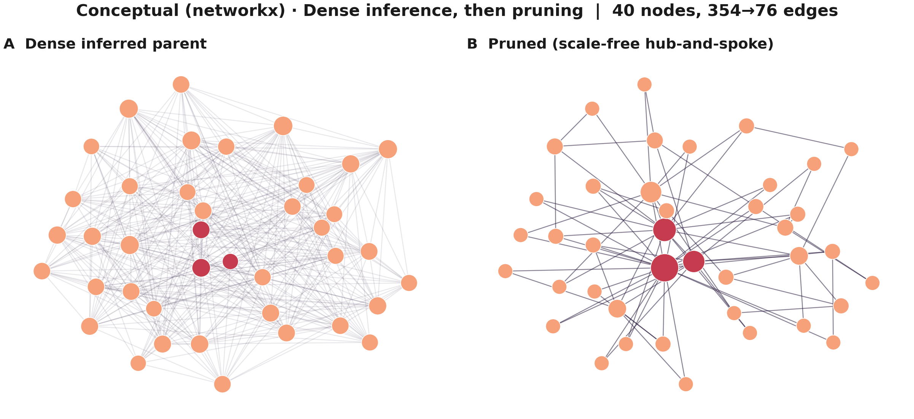
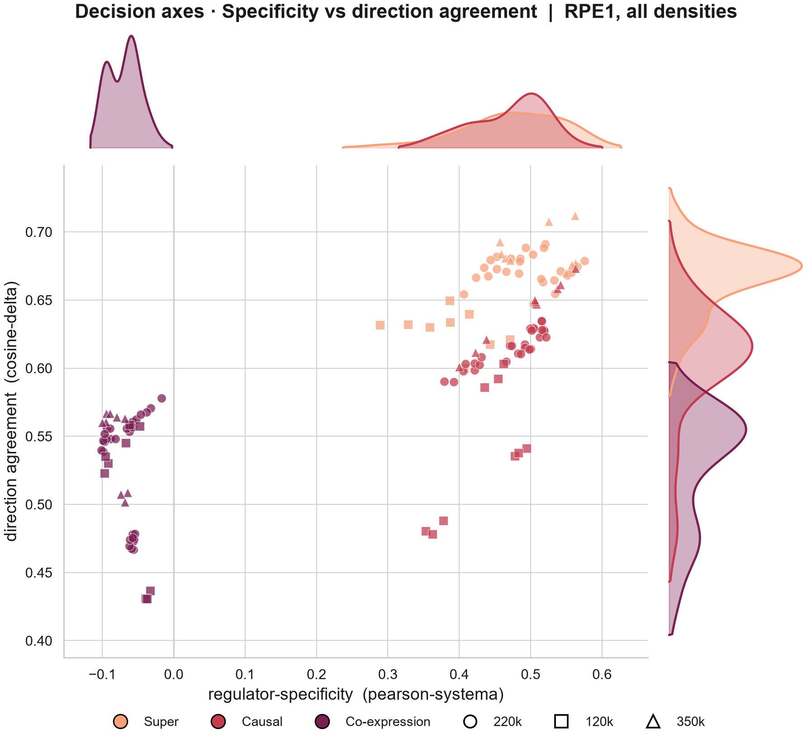
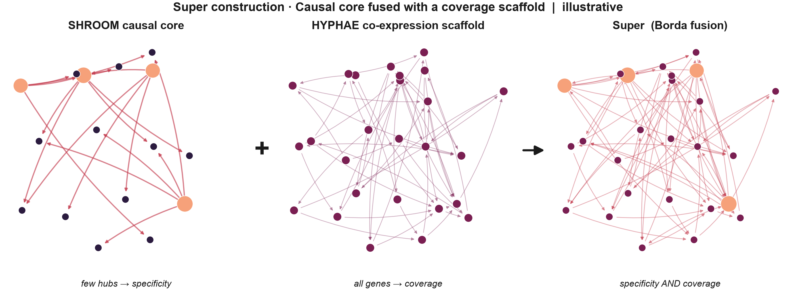

# FUNGI: Functional Unraveling of Network Geometry for Inference

**FUNGI builds cell-specific gene regulatory networks from CRISPR perturbation screens, shaped like real regulatory biology and built for perturbation prediction.**

   



> [!NOTE]
> FUNGI is a work in progress and under active development. The core pipeline runs end to end and the results below are real, but the code is being cleaned up and packaged for a methods preprint. Expect interfaces to change. See the [roadmap](#roadmap) and [`docs/KNOWN_ISSUES.md`](docs/KNOWN_ISSUES.md).

---

## What FUNGI is

A gene regulatory network (GRN) is the map of which genes control which others. It is the object a biologist reaches for to reason about what happens to a cell when a gene is switched off, and it is the scaffold that graph-based perturbation models predict over. The problem is that no ground-truth GRN exists, and the methods that infer one from data return dense graphs in which almost every gene pair carries a weight.

FUNGI turns a Perturb-seq screen into a usable regulatory map. It combines two complementary views of the data, a **causal graph** learned from what actually changes when each gene is knocked down and a **co-expression graph** that covers every gene in the panel, into a single **Super graph**. It then prunes that graph to a sparse network whose shape matches what the literature reports for real regulatory networks, with a small set of hub regulators, feed-forward motifs, and mostly one-directional regulation. Instead of applying a fixed cutoff, FUNGI treats that shape as an explicit objective and searches for the graph that meets it.

## What it is for

* **Building a regulatory map for your own cell line.** FUNGI reads the target bands from the data itself, so the same pipeline adapts to a new Perturb-seq dataset without hand-tuning.
* **Feeding graph-based perturbation predictors.** The output is a directed, weighted edge list that drops straight into any model that propagates a perturbation over a gene graph.
* **Prioritizing knockdowns before running them.** A graph that predicts held-out perturbation responses lets you rank candidate experiments in silico.
* **Reading the biology.** FUNGI graphs keep a hub hierarchy and low reciprocity, so the hubs and regulatory chains in the output can be inspected directly.

---

## Highlights

* **The Super graph carries regulator-specific signal that co-expression lacks.** In distribution, on a de-confounded score that strips out the response shared by every perturbation, causal and Super graphs score **+0.42 to +0.54** on RPE1, while every pure co-expression graph scores **below zero**.
* **It beats the linear baseline the field struggles with.** Read by the downstream model, the FUNGI Super graph scores **+0.472** against **+0.198** for a ridge-regression baseline, the simple linear model that recent deep perturbation predictors have repeatedly failed to beat [3].
* **It generalizes to perturbations it never saw.** A coverage-preserving Super graph is **2.1× more regulator-specific** on held-out perturbations than the earlier construction (0.089 against 0.042) and covers **all 373** held-out RPE1 perturbations against 247.
* **The signal is real wiring.** Scrambling or reversing the edges collapses the advantage, and flipping every edge of the zero-shot graph drives its score negative (+0.098 to −0.054).
* **The graph is readable.** FUNGI is the only pruner tested whose Super graphs keep both a hub hierarchy and low reciprocity on both cell lines, at the same predictive accuracy as structure-blind pruning.
* **Zero ontology, light hardware.** The downstream model uses no gene ontology, no pretrained embeddings, and no gene identity, so every result belongs to the graph. Every stage except the co-expression generator runs on a single workstation GPU, and the pipeline was developed on an 8 GB laptop GPU.



*Every graph, every seed and all three edge densities on RPE1. The x-axis is regulator-specificity after removing the shared response, and the y-axis is agreement with the direction of the true response. Super graphs (orange) sit top-right, causal graphs (red) just below, and co-expression graphs (purple) bottom-left. The three groups stay separated at every density.*

The results come from two CRISPRi Perturb-seq screens with a tenfold difference in perturbation coverage. RPE1 is the genome-scale screen of Replogle et al. [1], and h1-hESC is the stem cell screen from the Virtual Cell Challenge [2]. The full evidence, with every control, is in [`docs/RESULTS.md`](docs/RESULTS.md).

---

## How it works

FUNGI runs as five stages. Each stage also works on its own, so a user who only needs a clean dataset, or who already has a dense graph and only wants it pruned, can take just that piece.

| step | stage | what it does |
|---|---|---|
| 1 | **SPORE** | Cleans the raw data, splits it by perturbation so no evaluated gene leaks into training, and builds the metacell substrate. Also a standalone Perturb-seq cleaner. |
| 2a | **Co-expression generator** | One gradient-boosted regression per gene. Every gene gets out-edges. |
| 2b | **Causality generator** | Reads edge direction from knockdown responses. Edges point from a silenced gene to the genes it moves. |
| 3 | **Super graph** | Fuses the two graphs by rank, in the wisdom-of-crowds tradition of DREAM5 [4]. |
| 4 | **FUNGI pruner** | Scores every edge with the DASH kernel and searches for the sparse graph that best matches six literature topology targets. |
| 5 | **RHIZO** | A zero-ontology graph neural network that predicts perturbation responses from the graph alone, used to test any graph against any other. |



*The causal graph contributes a few highly specific hubs, the co-expression graph contributes coverage of every gene, and the Super graph carries both.*

The fusion is what makes the Super graph work. A causal edge can only start at a gene that was actually perturbed, which covers 17.3% of the RPE1 panel and 1.8% of h1-hESC. A causal-only graph therefore cannot speak for most regulators, and it has nothing to offer at held-out perturbations. FUNGI accepts a co-expression graph on its own, but a causal graph is only a supported standalone input in the rare dataset where every gene was perturbed. The Super graph keeps the causal core's specificity and borrows coverage from the co-expression graph, which is why it is the recommended input.

The stages in depth, the topology targets, the DASH kernel and the search are in [`docs/HOW_IT_WORKS.md`](docs/HOW_IT_WORKS.md).

---

## Getting started

Run the stages in order. Each one writes a file the next one reads.

```bash
python spore/spore.py --config spore/configs/spore_config_rpe1.yaml                 # 1  clean + split
sbatch coexpression_generator/submit_coexpression.sh                                 # 2a co-expression graph (CPU cluster)
python causality_generator/causality_generator.py --mc-input ... --sc-input ...     # 2b causal graph (GPU)
python supergraph/build_super_parent.py --mode fuse_then_prune --out super_dense.parquet   # 3  Super graph
python fungi/scripts/build_fungi_cache.py --graph super_dense.parquet --cache-dir cache/super --tag super
python fungi/scripts/fungi_prune.py --cache-dir cache/super --tag super --lam-lo 40 --lam-hi 48 --refine   # 4  prune
```

The full walkthrough, with every argument, hardware notes and the RHIZO evaluation step, is in [`docs/RUNNING.md`](docs/RUNNING.md). Several scripts still carry paths from the development machine, so read [`docs/KNOWN_ISSUES.md`](docs/KNOWN_ISSUES.md) before the first run.

```
FUNGI/
  spore/                   data cleaning, splits, metacell substrate
  coexpression_generator/  dense co-expression graph
  causality_generator/     dense causal graph
  supergraph/              causal + co-expression fusion
  fungi/                   the pruner
  rhizo/                   the downstream graph neural network
  baselines/               Top-Weight / KNN comparison graphs and null graphs
  evaluation/              de-confounded scorer and graph evaluators
  docs/                    guides, results, figures, thesis
```

---

## Roadmap

FUNGI is being prepared for a methods preprint. The active work:

* **Zero utopian loss on a coverage-preserving Super graph.** FUNGI has reached zero loss on a single-cell causal graph. On the full-coverage Super graph the best result so far lands five of the six literature targets in band, and closing the sixth is the current focus.
* **Model-specific synthetic search.** Once a zero-loss Super graph exists, a second search stage tunes the graph for a specific downstream model. The machinery is built and has been exercised end to end.
* **Industry-standard comparisons.** Swapping FUNGI graphs into third-party models (GEARS, CellOracle) and benchmarking against a pySCENIC co-expression network.
* **Cluster verification of the co-expression generator.** The hardened worker in this repository is rebuilt from notes and will be checked against the cluster original.
* **Packaging.** Replacing hard-coded paths with arguments and configs, adding environment files per stage, and retiring the thesis-era internal names.

---

## Read more

The pipeline was developed as a Master's thesis, which covers every stage, design decision and experiment in full. The thesis uses the original stage names (MYCELIUM for the whole pipeline, HYPHAE for the co-expression generator, SHROOM for the causality generator).

* **Thesis (PDF):** [`docs/thesis/Sheehan_2026_MYCELIUM_thesis.pdf`](docs/thesis/Sheehan_2026_MYCELIUM_thesis.pdf)
* **How it works:** [`docs/HOW_IT_WORKS.md`](docs/HOW_IT_WORKS.md)
* **Results:** [`docs/RESULTS.md`](docs/RESULTS.md)
* **Running it:** [`docs/RUNNING.md`](docs/RUNNING.md)

If you use FUNGI, please cite the thesis until the preprint is out:

```
Sheehan, P. (2026). MYCELIUM: A Unified Pipeline for Causal Gene Regulatory Network
Inference from Single-Cell Perturbation Data. MSc thesis, University of Milan / Human Technopole.
```

---

## Acknowledgements

FUNGI began as a Master's thesis in Quantitative Biology at the University of Milan, hosted at Human Technopole under the supervision of Dr. Andrea Sottoriva, with Dr. Beatrice Bodega as internal advisor. Michele Calabrò helped shape the ideas behind the FUNGI pruner, and Dr. Chinmaya Joisa provided the compute that built the RPE1 co-expression graph.

## References

1. Replogle, J. M. et al. Mapping information-rich genotype-phenotype landscapes with genome-scale Perturb-seq. *Cell* 185, 2559–2575 (2022).
2. Roohani, Y. et al. Virtual Cell Challenge: toward a Turing test for the virtual cell. *Cell* 188, 3370–3374 (2025).
3. Ahlmann-Eltze, C., Huber, W. & Anders, S. Deep-learning-based gene perturbation effect prediction does not yet outperform simple linear baselines. *Nat. Methods* 22, 1657–1661 (2025).
4. Marbach, D. et al. Wisdom of crowds for robust gene network inference. *Nat. Methods* 9, 796–804 (2012).

## License

MIT. See [`LICENSE`](LICENSE).
